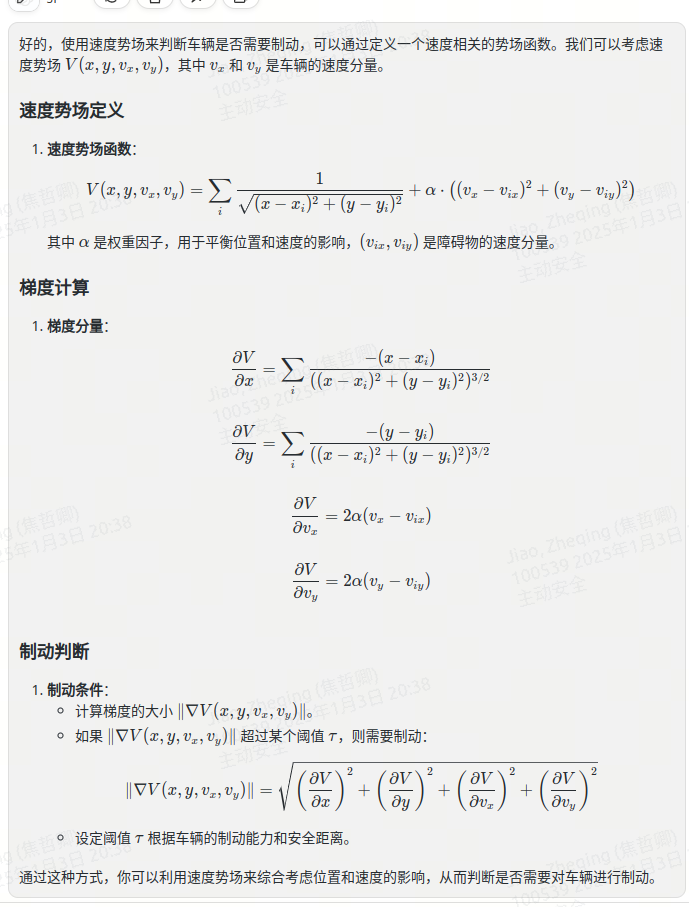

AF 法

\# 速度势场方法 ## 速度势场定义 

1. ***\*速度势场函数\****：   
   $$
   V(x, y, v_x, v_y) = \sum_{i} \frac{1}{\sqrt{(x - x_i)^2 + (y - y_i)^2}} + \alpha \cdot \left( (v_x - v_{ix})^2 + (v_y - v_{iy})^2 \right)
   $$
   

   其中 $\alpha$ 是权重因子，用于平衡位置和速度的影响，$(v_{ix}, v_{iy})$ 是障碍物的速度分量

2.  ## 梯度计算

3.  ##  1. ***\*梯度分量\****：   

4. \[   \frac{\partial V}{\partial x} = \sum_*{i} \frac{-(x - x*_i)}{((x - x_*i)^2 + (y - y*_i)^2)^{3/2}}   \]   \[   \frac{\partial V}{\partial y} = \sum_*{i} \frac{-(y - y*_i)}{((x - x_*i)^2 + (y - y*_i)^2)^{3/2}}   \]   \[   \frac{\partial V}{\partial v_*x} = 2\alpha (v*_x - v_*{ix})   \]   \[   \frac{\partial V}{\partial v*_y} = 2\alpha (v_*y - v*_{iy})   \] ## 制动判断 1. ***\*制动条件\****：   - 计算梯度的大小 \(\|\nabla V(x, y, v_*x, v*_y)\|\)。   - 如果 \(\|\nabla V(x, y, v_*x, v*_y)\|\) 超过某个阈值 \(\tau\)，则需要制动：   \[   \|\nabla V(x, y, v_*x, v*_y)\| = \sqrt{\left(\frac{\partial V}{\partial x}\right)^2 + \left(\frac{\partial V}{\partial y}\right)^2 + \left(\frac{\partial V}{\partial v_*x}\right)^2 + \left(\frac{\partial V}{\partial v*_y}\right)^2}   \]   - 设定阈值 \(\tau\) 根据车辆的制动能力和安全距离。*

# 势场法衡量ODO下