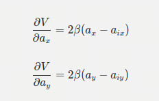

# Artificial Field for Active Safety

利用势场法建立一个类似于urgency的归一化衡量标准

利用数据驱动看是否可以作为误触发抑制的衡量标准之一

以自车原轨迹终点建立吸引场

以障碍物建立斥场

结合示意图

考虑障碍物的运动

## 1速度势场

tips 本质上应该以范数形式书写,这里为了避免麻烦直接展开为二范数

### 1.1速度势场定义

$$
V(x, y, v_x, v_y) = \sum_{i} \frac{1}{\sqrt{(x - x_i)^2 + (y - y_i)^2}} + \alpha \cdot \left( (v_x - v_{ix})^2 + (v_y - v_{iy})^2 \right)
$$

其中 $\alpha$ 是权重因子，用于平衡位置和速度的影响，$(v_{ix}, v_{iy})$ 是障碍物的速度分量

### 1.2梯度计算

分量计算

#### 1.2.1 x

$$
\frac{\partial V}{\partial x} = \sum_{i} \frac{-(x - x_i)}{((x - x_i)^2 + (y - y_i)^2)^{3/2}}
$$

#### 1.2.2 y

$$
\frac{\partial V}{\partial y} = \sum_{i} \frac{-(y - y_i)}{((x - x_i)^2 + (y - y_i)^2)^{3/2}}
$$

#### 1.2.3 vx

$$
\frac{\partial V}{\partial v_x} = 2\alpha (v_x - v_{ix}) 
$$

#### 1.2.4 vy

$$
 \frac{\partial V}{\partial v_y} = 2\alpha (v_y - v_{iy})
$$

#### 1.2.5 梯度大小$$\|\nabla V(x, y, v_*x, v*_y)\|$$

$$
\|\nabla V(x, y, v_x, v_y)\| = \sqrt{\left(\frac{\partial V}{\partial x}\right)^2 + \left(\frac{\partial V}{\partial y}\right)^2 + \left(\frac{\partial V}{\partial v_x}\right)^2 + \left(\frac{\partial V}{\partial v_y}\right)^2} 
$$

### 1.3难点

很明显,在势场设计的时候,用权重因子,将位置和速度作了一次归一化,难点就在于权重因子的取值

此外AS对加速度有依赖,将加速度设计进势场可能是必要的,但是会大大加大归一化的难度

![image-20250109115334325](./势场.assets/image-20250109115334325.png

