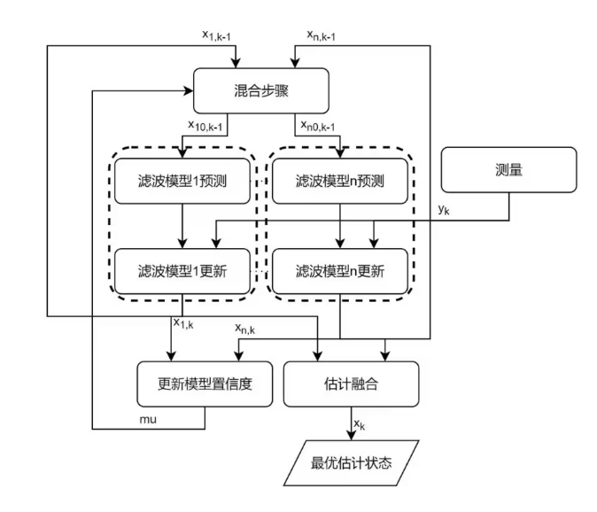
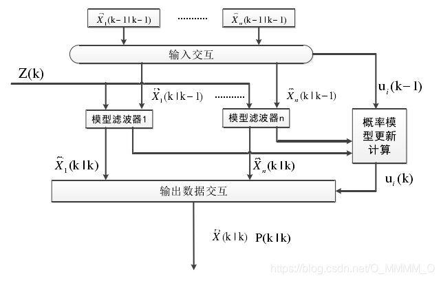
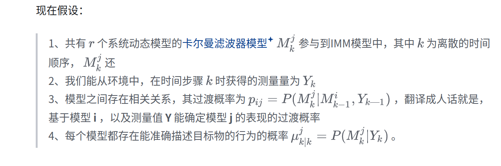
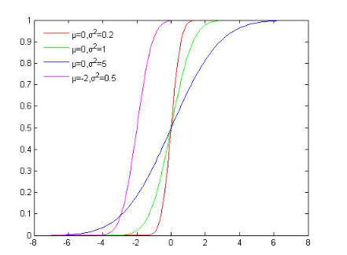
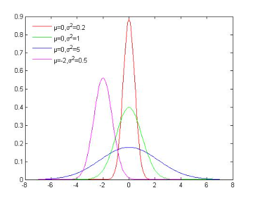
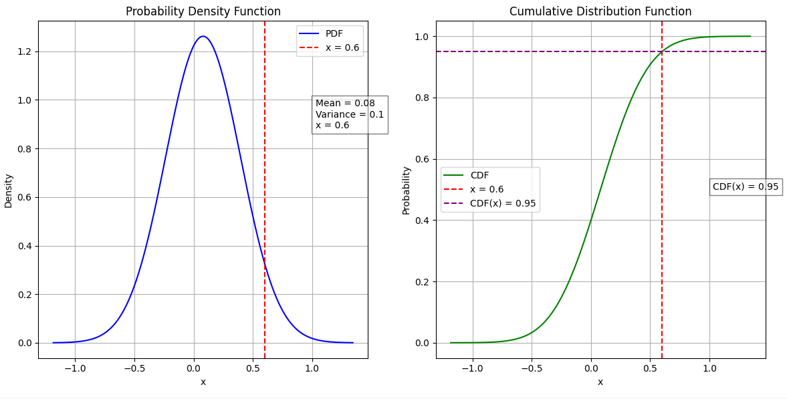
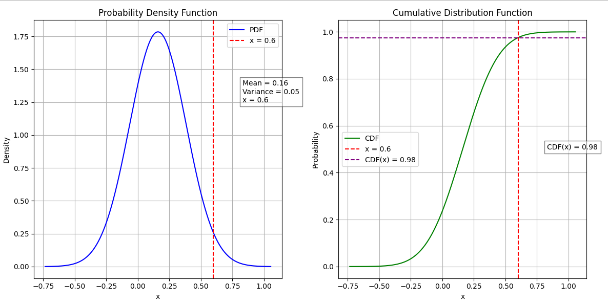
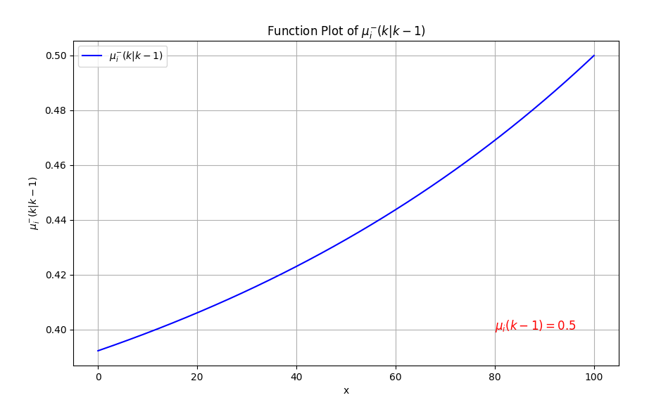

IMM

author : Slade.jiao

参考资料:

https://www.bilibili.com/read/cv23904657/   适合入门

https://www.cnblogs.com/sbb-first-blog/p/17029001.html 看的时候注意公式(5)有误

https://www.cnblogs.com/sbb-first-blog/p/17029001.html 补充一些公式

基本就是融合上述三篇做的笔记

在学习imm之前,保证有良好的KF基础

# IMM 基础推导

## 1. 流程

### 1.1 输入

与正常的KF相同,在局部都是一个k-1到k的过程

fig1 过程图解

IMM算法采用多个Kalman滤波器进行并行处理。每一个滤波器对应着不同的状态空间模型，不同的状态空间模型描述不同的目标运动模式，因此每一个滤波器对目标的状态估计是不同的。

设,在每个离散的时间内,有r个滤波模型

在k-1时刻,每个模型拥有自己的最佳估计:
$$
\hat{x}_{i,k-1}
$$
 i 表示模型的序列,k表示离散时间

在后面的推导中,也会写成:
$$
\hat{x}_{i}(k-1)
$$

根据KF特性,k-1时刻同时还有其协方差矩阵P:
$$
\hat{P}_{i,k-1}
$$

也就是流程图的输入

### 1.2 混合步骤

我觉得混合步骤是IMM最抽象的一个概念

先这么类比一下,就是P是协方差矩阵,那么意味这p_ij,本身代表了,状态元素之间的相关性

那么大概理解IMM中的概念就是,r中的模型i,模型j之间也有相关性,那么这也是交互式模型中"交互"的概念

那么我们以下标0当一个离散时间预测前的表达,并且为了避免下表过长,我把k-1写在()内
$$
\hat{x}_{0,i}(k-1) = \sum_{j=1}^{r}\mu_{j|i}(k-1)\hat{x}_{j}(k-1)
\\(1)
$$
其中i和j都是r个模型中的元素

其中
$$
\mu_{j|i}(k-1)
$$
表示在单个离散时间内,模型从j转移到i的可能性,被称为混合概率

求和后
$$
\hat{x}_{0,i}(k-1)
$$

可以理解为得到了IMM中,模型i在k-1时刻真正的最佳估计,也就是后续预测步骤的输入

其中,如何得到混合概率

那么这里共有两个概念得到,也是IMM的两大核心

1. Markov 转移矩阵 pij(***小写p用于与大写P协方差矩阵作区别***),表示对于模型i由模型j转移的概率

$$
p_{markov} = \begin{bmatrix}p_{1,1} ...p_{1,r}\\
              ...\\
              p_{r,1}...p_{r,r}
             \end{bmatrix}
$$

1. 模型概率mu,这个后面会得到如何计算的过程,模型j在k-1时刻的概率
   $$
   \mu_j
   $$

基本步骤为:

首先由模型概率j乘以由j转移到i的转移概率,那么理论上是不是已经得到了由j到i的概率

但事实上还要做一次归一化,即在分母对所有模型转移到i的概率进行累和

$$
\mu_{j|i}(k-1) = {p_{i,j}\mu_j(k-1)\over{\sum_{l=1}^{r}p_{i,l}}\mu_l(k-1)}\\
(2)
$$
#### 例子

为了防止对两次求和有不理解的情况(对我来说一开始是有点抽象了)

举个例子:

我们有三个模型,对应的状态转移矩阵P:
$$
\begin{bmatrix}
0.7&0.2&0.1\\
0.3&0.4&0.3\\
0.2&0.3&0.5
\end{bmatrix}
$$

设k-1的模型概率为:
$$
\mu(k-1) = \begin{bmatrix}
            0.5\\
            0.3\\
            0.2
           \end{bmatrix}
$$
状态估计:
$$
\hat{x}(k-1) = \begin{bmatrix}
                10\\
                20\\
                30
               \end{bmatrix}
$$
计算对模型1的条件概率:
$$
\mu_{j|1} = 0.7\times0.5 + 0.2\times0.3 + 0.1\times0.2 = 0.41
$$

所有模型的条件概率:
$$
\mu_{1|1} = {0.7\times0.5\over0.41} \approx 0.8537\\
\mu_{2|1} = {0.2\times0.3\over0.41} \approx 0.1463\\
\mu_{3|1} = {0.1\times0.2\over0.41} \approx 0.0488
$$
混合状态估计:
$$
\hat{x}_{0,1}(k-1) = 0.8537\times10 + 0.1463\times20 + 0.0488\times30 \approx12.927
$$
混合后的协方差矩阵
$$
 \hat{P}_{0,i}(k-1)\
$$
的公式为：
$$
\hat{P}_{0,i}(k-1) = \sum_{j=1}^{M} \mu_{j|i}(k-1) \left( \hat{P}_j(k-1) + \left(\hat{x}_j(k-1) - \hat{x}_{0,i}(k-1)\right) \left(\hat{x}_j(k-1) - \hat{x}_{0,i}(k-1)\right)^T \right)\\
(3)
$$
好的，以下是一个关于混合协方差矩阵的例子：

假设我们有三个模型的协方差矩阵和状态估计：

协方差矩阵
$$
\hat{P}_1(k-1) = \begin{bmatrix} 2 & 0 \\ 0 & 3 \end{bmatrix}
$$

$$
\hat{P}_2(k-1) = \begin{bmatrix} 1 & 0 \\ 0 & 4 \end{bmatrix}
$$

$$
\hat{P}_3(k-1) = \begin{bmatrix} 3 & 0 \\ 0 & 2 \end{bmatrix}
$$

状态估计
$$
\hat{x}_1(k-1) = \begin{bmatrix} 10 \\ 5 \end{bmatrix}
$$

$$
\hat{x}_2(k-1) = \begin{bmatrix} 20 \\ 15 \end{bmatrix}
$$

$$
\hat{x}_3(k-1) = \begin{bmatrix} 30 \\ 25 \end{bmatrix}
$$

假设我们已经计算了模型 1 的混合状态估计:
$$
\hat{x}_{0,1}(k-1) = \begin{bmatrix} 12.927 \\ 10 \end{bmatrix}
$$
以及权重：
$$
\mu_{1|1}(k-1) \approx 0.8537
$$

$$
\mu_{2|1}(k-1) \approx 0.1463
$$

$$
\mu_{3|1}(k-1) \approx 0.0488
$$

计算混合后的协方差矩阵
$$
\hat{P}_{0,1}(k-1) = \sum_{j=1}^{3} \mu_{j|1}(k-1) \left( \hat{P}_j(k-1) + \left(\hat{x}_j(k-1) - \hat{x}_{0,1}(k-1)\right) \left(\hat{x}_j(k-1) - \hat{x}_{0,1}(k-1)\right)^T \right)
$$
计算步骤

1. **模型 1 的贡献**:
   $$
   \left(\hat{x}_1(k-1) - \hat{x}_{0,1}(k-1)\right) = \begin{bmatrix} 10 \\ 5 \end{bmatrix} - \begin{bmatrix} 12.927 \\ 10 \end{bmatrix} = \begin{bmatrix} -2.927 \\ -5 \end{bmatrix}
   $$

   $$
   \left(\hat{x}_1(k-1) - \hat{x}_{0,1}(k-1)\right) \left(\hat{x}_1(k-1) - \hat{x}_{0,1}(k-1)\right)^T = \begin{bmatrix} 8.57 & 14.635 \\ 14.635 & 25 \end{bmatrix}
   $$

   $$
   \mu_{1|1}(k-1) \left( \hat{P}_1(k-1) + \ldots \right) = 0.8537 \left( \begin{bmatrix} 2 & 0 \\ 0 & 3 \end{bmatrix} + \begin{bmatrix} 8.57 & 14.635 \\ 14.635 & 25 \end{bmatrix} \right)
   $$

2. **模型 2 和 3 的贡献**按同样的步骤计算。

3. **总和**:
   $$
   \hat{P}_{0,1}(k-1) = \text{模型 1 的贡献} + \text{模型 2 的贡献} + \text{模型 3 的贡献}总结:
   $$

#### 总结

举个例子就清晰很多了

其实所谓混合概率,就是是否受别的模型的最佳估计影响的权重

但是必须注意:

**在交互式多模型（IMM）算法中，所有模型必须具有相同的状态维度和结构。这是因为在模型之间进行转换和组合时，需要进行一致的加权平均和转换概率计算。**

**因此，如果模型 A 只维护位置，而模型 B 维护位置和速度，你需要将模型 A 扩展至包含速度的形式，以便与模型 B 一致。这通常意味着在模型 A 中添加速度状态，并假设其速度变化遵循某种简单的动态（例如，速度恒定为0），以便与其他模型保持一致的状态结构。**

### 1.3 滤波过程

在滤波过程中,和普通的KF没有区别,不作展开,不懂先看Kalman去

只不过输入为混合后的最佳估计

$\hat{x_i}(k|k-1)$先验:
$$
\hat{x}_i(k|k-1) = F_i\hat{x}_{0,i}(k-1) +B_iu_k\\
(4)
$$

- $B_i$ 模型 i 的控制输入矩阵（如果有控制输入）,一般在ADAS中不会有
- $F_i$状态转移矩阵
- $u_k$ k 时刻的控制输入

协方差:
$$
{P}_i(k|k-1) = F_iP_{0,i}(k-1) +Q_i\\
(5)
$$

- $Q_i$过程噪声

Kalman增益:
$$
K_i(k) = P_i(k|k-1)H_i^T(H_iP_i(k|k-1)H_i^T + R_i)^{-1}\\
(6)
$$

- $H_i$观测矩阵
- $R_i$观测噪声

后验$\hat{x_i}(k|k)$ :
$$
\hat{x_i}(k|k)=\hat{x_i}(k|k-1)+K_i(k)[Z_i(k)-H_i(k)\hat{x_i}(k|k-1)]\\
(7)
$$

- $Z_i(k)$观测向量

协方差矩阵更新:
$$
P_i(k|k)=[I-K_i(k)H_i(k)]P_i(k|k-1)\\
(8)
$$

### 1.4 更新模型概率

其实这一步才相当于KF的更新,因为正如1.2混合步骤中的

IMM的核心之一就是模型概率,这一步会介绍如何得到模型概率

**似然函数**更新模型概率$\mu_i(k)$

**创新误差**的计算:
$$
v_i(k)=Z_i(k)-H_i(k)\hat{x_i}(k|k_1)\\
(9)
$$
观测和预测的残差

似然函数公式:
$$
L_i(k)={1\over(2\pi)^{n/2}|S_i(k)|^{1/2}}exp(-{1\over2}v_i^TS_i^{-1}(k)v_i)\\
(10)
$$
当然公式中,我们默认KF作用于正态分布的空间,因此需要正态分布的归一化

似然函数的基本介绍:

1. 正态分布系数${1\over(2\pi)^{n/2}|S_i(k)|^{1/2}}$,用于归一化,确保函数的积分为1
2. n是观测向量的维度
3. $|S_i(k)|$是观测的预测协方差矩阵的行列式

$$
S_i(k) = H_i(k)P_i(k|k-1)H_i^T(k)+R_i(k)\\
(11)
$$

模型概率公式是这样的:
$$
\mu_i(k)={\mu_i^-(k|k-1)L_i(k)\over{c}}\\
(12)
$$
其中:

- $\mu_i^-(k|k-1)$为模型概率的先验
  $$
  \mu_i^-(k|k-1) = \sum_{j=1}^r\mu_j(k_1)p_{ji}
  $$
  本质上就是通过转移矩阵对k-1的时刻作预测

- c是对分子作归一化的
  $$
  c = {\sum_{m=1}^r\mu_m^-(k|k-1)L_m(k)}
  $$
  这里用m区别求先验时的j

老规矩,我们举个例子

#### 例子

两个模型R1 R2

在k-1时刻,分别拥有模型概率$\mu_1(k-1) = 0.7$和$\mu_2(k-1) = 0.3$

对应的转移矩阵
$$
P = \begin{bmatrix}0.8&0.2\\
    0.3&0.7
    \end{bmatrix}
$$
那么
$$
\mu_1^-(k|k-1) = \mu_1(k-1)p_{1,1}+\mu_2(k-1)p_{2,1}\\
\mu_1^-(k|k-1) = 0.7\times0.8 + 0.3\times0.3 = 0.65\\
\mu_2^-(k|k-1) = 0.7\times0.2 + 0.3\times0.7 = 0.35
$$
设k时刻观测z(k)以及其似然概率L1/L2
$$
L_1(z(k))=0.6\\
L_2(z(k))=0.4
$$

计算归一化因子:
$$
c(k) = \mu_1^-(k|k-1)L_1(z(k)) + \mu_2^-(k|k-1)L_2(z(k))\\
c(k) = 0.65\times0.6 + 0.36\times0.4 = 0.53
$$
计算模型概率:
$$
\mu_1(k)={\mu_1^-(k|k-1)L_1(k)\over{c}}\\
\mu_1(k)={0.65\times0.6\over0.53}\approx0.7358\\
\mu_2(k)={0.35\times0.4\over0.53}\approx0.2642
$$
举例完毕,那么到这里.我们得到了k时刻各个模型的模型后验$\hat{x_i}(k)$以及其模型概率$\mu_i(k)$,也就是下周期的输入

## 2. IMM变道问题

在ADAS Prediction中,借鉴Apollo中的预测器(Apollo6.0)

我们想求解一个结构化道路中的变道问题,首先把这个问题拆解成两个部分:

1. 意图预测
2. 轨迹生成

在Appolo7.0之后的版本中,演化成了

我们可以宏观的先去考虑这个问题,假设在任意时刻k在道线明确的结构化道路(非路口场景中),目标只有三个可能的意图:
$$
[向左变道,保持当前车道,向右变道]
$$
那么,我们就可以定义三个模型R1,R1,R3去代表这三个意图,那么我们可以认为在一个IMM系统中,k时刻的模型概率就代表了目标执行该意图的概率

#### 问题1

如何用一个KF的模型描述这三种意图

先来串一下流程

### 2.1宏观流程

在k-1时刻,我们有上周期的模型概率$\mu_r(k-1)$,卡尔曼后验状态$\hat{x}_r$

#### 2.1.1过程整理

参考公式(1)得到混合状态估计,以模型R2(居中))为例

由于是个三模型IMM,其转移矩阵一定是3*3的

但是这里有个之前一直忽略的问题

#### 问题2

这里的转移矩阵是什么

#### 转移矩阵

首先我们要明确一个概念,在imm系统中,转移矩阵并不是不变的

在交互式多模型（IMM）算法中，转移矩阵不一定是不变的。转移矩阵（或称为模型转移概率矩阵）用于描述不同模型之间的转换概率，它可以根据具体应用和系统的动态特性进行调整。

**情况分析**

1. **固定转移矩阵：**
   - 在某些应用中，转移矩阵可能是固定的，假设系统的动态特性在整个操作过程中保持不变。
   - 这种情况下，转移矩阵通常在设计时根据经验或历史数据设定。
2. **动态调整转移矩阵：**
   - 在复杂或变化较大的环境中，转移矩阵可能需要动态调整，以更好地适应系统的变化。
   - 这种调整可以基于实时观测数据、环境变化或其他外部信息来实现。

**影响因素**

- **系统特性**：如果系统的动态特性会随时间变化，则可能需要调整转移矩阵。
- **外部环境**：外部条件变化显著时，也可能需要动态调整。
- **设计需求**：根据具体的应用需求和精度要求，可能决定是否使用固定或动态的转移矩阵。

因此，在 IMM 算法中，转移矩阵是否不变取决于系统的特性和应用场景的需求。

我问了下GPT他的理解(但是出现了前后不统一,最早他认为初始混合和更新用的都是k时刻的转移矩阵)

1. **混合步骤**：
   - 在时刻 *k*，混合过程使用的是从时刻 k−1 到 k 的转移矩阵。这是为了计算在时刻 k−1 各模型状态的混合概率，得到时刻 k的初始状态估计。
2. **更新步骤**：
   - 更新过程在时刻 k 使用当前观测数据更新状态估计和模型概率。

因此，混合过程是基于时刻 k−1 的信息和转移矩阵进行的，而更新过程则是在时刻 k 进行的。这种设计确保了在每个时刻内，模型状态估计和转换关系的连续性和一致性。

以上是ChatGpt的回答

这里非常重要(也和我见过当前的实现有所不同)

我们用个非常简单的例子思考一下,假设转移矩阵受目标Frenet下的横向速度影响(很好理解,有往左的速度自然向左变道的概率更大)

但这个横向速度哪里来呢(无非是k-1到k的预测或者k的观测,虽然实际都不是)但这都是KF滤波过程的产物,此时你在混合过程中还没有这个东西,因此,其实这个时候只有p(k-1)

这是知乎的文章中唯一提到过的,也是和我的想法一致,大概意思就是Markov转移矩阵是受当时刻的观测影响的,而在混合过程中肯定不会引入k时刻的观测的

但是anyway,这里一定要得到:

a) $\lambda(k-1)$   概率转移矩阵,就是前面的小写p,但是在公式中还是和大写P写方差太像,改记

b) 混合概率矩阵U,由$\mu_{j,i}(k|k-1)$组成

得到初始混合最佳估计

c) $\hat{x_{0,i}}(k-1)$

完成混合部分

d)其实,如果模型概率是最终要求的解,我们并不关心独立的最佳估计,而是要通过预测,这步最终要的是要得到预测$\hat{x}_i(k|k-1)$

完成滤波过程

e)计算创新误差$v_i(k)$,似然度$L_i(k)$

f)更新模型概率$\mu_{i}(k)$

### 2.2 当前实现(Driving)

在每个周期,从目标轨迹的起点开始进行滤波(for loop)

构建LaneProb实际上就是$\mu$

混合模型概率

a)

构建转移矩阵,3*3的$\lambda$,并设初始值为(其中我至今不明白为什么第二行的和可以不为0):
$$
\lambda_0 = \begin{bmatrix} 0.94&0.05&0.01\\
            0.05&0.89&0.05\\
            0.01&0.05&0.94
            \end{bmatrix}
$$
在每个周期,独立的更新转移矩阵

也就是说,都是从上述的矩阵得到的(这么理解吧,就是认为k-1永远是上面那个)

这一步是很关键的,就是转移矩阵如何受观测影响的,撇开用k还是k-1的观测,本身更新的方式是很重要的

那么有两个重要概念

当前在非crowded场景下使用的是frenet下的横向速度作为影响观测量

- CDF 累计概率分布,画一下就知道是什么了

再看看这个

dei,下面那个是概率密度,上面那个本质就是下面那个对随机变量在一定范围内求积分

大概的形式就是,设为保持原模型,向左切换原模型,向右切换原模型几种情况,给定一个均值和标准差作为参数,去动态调节转移矩阵,但是在实现上我依旧有些疑惑

- 只用横向速度的观测对吗,我觉得横向速度并不能单纯得反映转移概率的直观变化
- 这个均值为什么可以在直道保持状态的情况下不为0,这太抽象了

对3*3的每一行作归一化

以第一行为例

分别计算p11,p12,p13

那么假设有个0.6mps的速度可以看到
$$
p_{1,1} = 0.94 + (1-0.95) = 0.99\\
p_{1,2} = 0.05 + 0.98 = 1.03\\
p_{1,3} = 0.01\\
归一化常数 c = 0.99 + 1.03 + 0.01 = 2.03,更新\\
p_{1,1} = 0.488\\
p_{1,2} = 0.507\\
p_{1,3} = 0.005
$$
可以看到这么小依旧已经让左转到居中的转移概率超过保持了

并且在高速下会更明显,不过由于原本的存在会导致不会变得太大

b)根据公式(2)求出模型混合条件概率

这里暂不赘述

c)作混合,输入的独立最佳估计为{3.75,0,-3.75}

写两个1*3的矩阵,分别代表:

- 混合估计$\hat{x}_{0,i}(k-1)$
- 混合协方差估计$\hat{P}_{0,i}(k-1)$

从输入可以回答问题1,所谓的模型,就是指在主道以及左右邻道行驶,维护的状态向量恒为Frenet下横向位置

关于协方差,详见公式(3)
$$
\hat{P}_{0,i}(k-1) = \sum_{j=1}^{M} \mu_{j|i}(k-1) \left( \hat{P}_j(k-1) + \left(\hat{x}_j(k-1) - \hat{x}_{0,i}(k-1)\right) \left(\hat{x}_j(k-1) - \hat{x}_{0,i}(k-1)\right)^T \right)
$$
其中P(k-1) 恒为 3.75/4 (这里好像又挺大)

d)因为本质上状态向量就只有位置,因此这里根本就没有KF滤波过程

e)创新误差计算,由公式(9)

对于所有模型,观测恒为相对于中心ref_lane的Frenet下d坐标,而预测直接使用了上周期的混合估计,因此被改写成
$$
v_i(k) = Frenet.d -\hat{x}_{0,i}(k-1)
$$
协方差更新为:
$$
P_i(k) = P_{0,1}(k-1) + 3.75
$$
抽象得一匹(不应该是3.75/4么),但是后面根本没用到,因此无所谓

似然度计算,详见公式(10)
$$
L_i(k)={1\over(2\pi)^{n/2}|S_i(k)|^{1/2}}exp(-{1\over2}v_i^TS_i^{-1}(k)v_i)
$$
其中

- $S_i(k)$ 恒为3.75 输入
- 观测向量肯定是一维的

f) 更新模型概率$\mu_i(k)$
$$
\mu_i(k)={\mu_i^-(k|k-1)L_i(k)\over{c}}
$$
其中这里的模型概率先验很有意思,并不是由转移矩阵和上周期的模型概率得到的:
$$
设一个初始概率 \delta_{init}\\
\delta_{1} = \delta_{2} = \delta_{3} = 0.33\\
\mu_{i}^{-}(k|k-1) = (0.33 + (\mu_i(k-1)-0.33)\times{d})\\
这里d是一个和这是过去的第几周期有关的系数
d = 0.99^{MaxCycle - CurrentCycle}
也就是越早越衰减
$$
大概画出来就是这样

### 2.3 主动安全的实现

从Apollo 的实现来看,输入在构建完三车道模型之后,就只有当前的ref_lane,并转化为Frenet下的信息

对于AS而言,想要做一个新的尝试

首先看下可调参数:

- 影响转移矩阵的观测以及其对应的均值/协方差
- 协方差的定义方式
- 模型的先验概率

在其他基本保持一致的情况下,可以看到似然度表达的是观测是否契合模型的程度

有个想法模型建立从固定的左右3.75,换成了一个真实的观测

|         |         |

|         |         |

|         |         |

|       . |         |        

|         |         |     举个例子,原本观测应该是{3.75, 0 , -3.75}的

但是在这个模型定义中,会变成{2.75,-1,-4.75}

那么对吗,我们来看下从k-1到k的创新误差计算

假设混合先验就是{3.75,0,-3.75}

直接会让创新误差变成{1,1,1}所以不对

创新误差的计算在原模型中就是{2.75,1,4.75},看出来还是更接近中间的,也符合我们的直观感受

因此一开始的假设是不对的

#### 构想

本质上,最终是给轨迹生成的输出,向左还是向右变道重要吗,重要的是target lane,类似传统结合道线的做法,或者说基于SD的planning,哪跟道线是轨迹生成的参考线才是重要的

甚至于,基于当前的模型设定,模型的名字和意图叫"变道"本身就是不合理的,应该叫,我过去的一段时间内的运动,更符合哪条道

举个例子,从左到右分别为0/1/2

一开始1是中间道线,也是frenet的参考线,当主车开始向右变道的时候,道线组合变成1/2/3,越过线或者说NearestLane变为2时,只要保证意图表达的target lane一直是道线2,其实是不会影响下游生成轨迹的,即意图从"右"变为""中"

左右道线的衔接部分解决了,接下俩就是前后的事

当前算法中,会出现历史点的参考线已经落后,导致参考点的assum_S变为负的,从而导致IMM系统崩溃