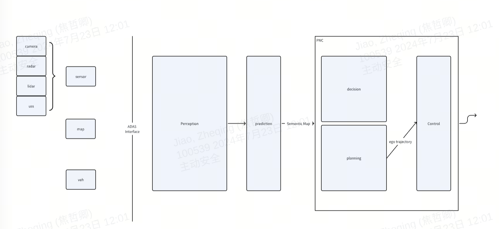
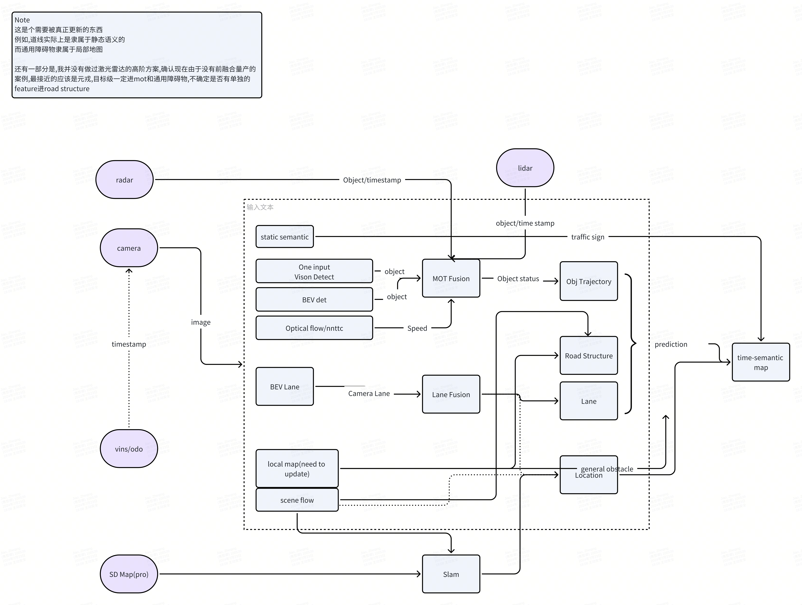

# What's ADAS

本文旨在记录ADAS学习过程中需要的知识点,毕竟一开始的理想就是成为一个系统

仅代表个人的一些观点,尤其架构部分综合了各家PNC1.0/PNC2.0的方法论,仅仅是一种讨论

再次讨伐某司,最早的TJP玩家最终成了义和团

# 1. 简易组成

参考world model roadmap,借由模型的参与程度来看全局的变化趋势

当前状态下模型被运用在双目深度估计/BEV等单一feature中是比较成熟的

当前的系统方案的核心都是感知构建带有时间轴的的一张cost图

- H称为时间走廊
- D称为全局语义地图

PNC在其中优化一个最佳路径,其中包含了Lang term planning (导航)/车辆运动学约束(在不同方案中出现了轻约束建立树再剪枝/或者说先决策再优化从而得到一个凸空间,后者在无时序cost图中用的比较多)

一个非常粗的构成

## 1.1 通用知识

### 一定要学:

- C++ ,不论算法还是系统都必须会

课程:菜鸟教程精通

- 汽车理论,至少掌握二自由度模型

课程:NA

- git,是个人都建议会,不管你是干嘛的

课程:菜鸟教程

### 建议学习:

- 机器学习,

课程:吴恩达机器学习

- ROS

课程:古月居ROS 21 讲

# 2. 感知

感知部分,以某热门科技公司为基础,暂时分为传感器/动态感知/静态感知/局部地图/slam/模型

其实像现在主流的是没有前融合的,也没有视觉以外的传感器在主要工作原理上在用深度学习,因此动态感知其实和模型/传感器是相互耦合的,但这里并非架构而是以知识板块作为梳理,且像tracking这个概念,其实是贯穿了整个感知的

并且与PNC相同,现在是时序感知而非单帧感知的时代

Note 

**这是个需要被真正更新的东西**

- 例如,道线实际上是隶属于静态语义的,而通用障碍物隶属于局部地图

- 还有一部分是,我并没有做过激光雷达的高阶方案,确认现在由于没有前融合量产的案例,最接近的应该是元戎,目标级一定进mot和通用障碍物,不确定是否有单独的feature进road structure
- Occupancy 还没来的及画但是其实是可以接进MOT中的
- 缺失scene flow的部分,其实有了Occ 也就不用了
- 确实SD Map Pro的输入以及使用

## 2.1 感知通识

### 2.1.1 tracking

正如前文所说,是贯穿了整个感知的东西,并不是只隶属于某个传感器独有的,只要最终你的输出在感知层想维护一个状态,那么大概率一定会有tracking的知识存在,比如你想维护的是动态目标的长宽高,位置,速度,加速度或者是道线的曲率,都需要tracking

甚至,我们熟悉的滤波器,也不过是tracking的一种方法而已

建议文档:https://homes.cs.washington.edu/~todorov/courses/cseP590/readings/tutorialEKF.pdf公开文档

UKF

Particle filter

### 2.1.2 视觉slam 14讲

他真的很好,但是除了一开始的基础部分,剩下的虽然都是应该在ADAS学习过程中需要转化的,但是我还是建议有了一定的基础在去看

你需要知道:

- 什么是slam?
- 为什么我们需要slam(所以不建议你直接看)?
- MTO在什么情况下比EKF的上限高?
- 梯度下降法/牛顿法/高斯牛顿法

## 2.2 传感器

### 2.2.1 Radar

radar是老V司人基本功,个人觉得radar现在存在的最大问题就是后端的工程师不会用,不管是4D还是普通的

不觉得radar作为smart senor不是值得学习的东西,除非你是个功能开发的初学者

不过,个人觉得现在诸如天线仿真/设计,波形设计等技术已经离我们很远了

- 原理:

https://www.ti.com.cn/content/dam/videos/external-videos/en-us/2/3816841626001/5415203482001.mp4/subassets/mmwaveSensing-FMCW-offlineviewing_0.pdf

TI 扫盲班

也有一篇关于DDMA的

https://www.ti.com.cn/cn/lit/an/zhcab85/zhcab85.pdf?ts=1721665235345

甚至出了中文版,但正如上文所说,知道就可以了

- RSP

Classic search and dwell 典

Smart search and dwell 你懂的

CFAR:

SAR:不学也罢

- Tracker

GEN 1.2 Notes 谁的都行

我觉得是个很经典的做法

1. 因为其中最重要的就是,点追踪是如何选点的,你要选最近点是因为什么,中心点又因为什么?
2. 如何在FOV边缘处理tracker,我觉得这是个一定要改的技术,不是不好,而是今后的感知都只会工作在BEV空间下,所以对雷达的tracker的要求改变了,但我觉得只有你明白了现在的融合在干什么,才能理解这点
3. 只有你会了点追踪,你才会开始对真正的框追踪以及3D检测开始思考,当然这都是后话

- 4D radar

1. DBscan 
2. radar的Elevation 在动态感知中的意义是什么

### 2.2.2 Vision

- 原理

​     视觉slam 14讲 重点!!!

1. 什么是camera 系? uvw,四元数,范数
2. 外参/内参

进阶内容

1. 相机畸变 , fisheye原理
2. 相机标定

- 视觉检测

1. 单输入检测技术 Cuboid(D) / Mono(H)
2. BEV det/Lane

​      会在模型和动态感知中展开

- 相机的深度估计

1. 双目原理
2. 基于deep learning的双目深度估计
3. 单目深度估计

### 2.2.3 Lidar

实在不会, TBD

## 2.2 动态感知

### 2.2.1 速度估计

#### 2.2.1.1 Optical flow

基本原理: 

综述: 

#### 2.2.1.2 nnttc

### 2.2.2 Fusion/MOT

#### 2.2.2.1 匹配

在这里你要清楚的理解什么是匹配,

匹配有个固有的问题:如何应对输入的 delay,比如雷达在整车上有150ms的时间同步 delay , 在高相对晕对状态下怎么办?

先预测后匹配还是先匹配后预测

- 前者会出现部分感知无法预测或者精度不够的可能,非常依赖单一传感器的性能
- 后者就是,你怎么知道谁是谁,对匹配的要求更高

此外你必须明白什么是全局最优,什么是局部最优

1. 马式距离
2. 匈牙利人算法
3. 贪心算法
4. KNN 

#### 2.2.2.2 Multi Trajectory Optimization

车辆二自由度状态:

## 2.3 静态语义

### 2.3.1 semantic detect

#### 2.3.1.1 traffic sign

### 2.3.2 道线检测

#### 2.3.2.1 Lane Detect

#### 2.3.2.2 Lane Fusion

## 2.4 局部地图

### 2.4.1 Scene flow

## 2.5 Model

并没有把类似BEV这样的东西仅仅放在动态感知中,因为我觉得深度学习现在是也只能是从感知开始进入ADAS,因此模型的记录就应该是从感知的发展开始

当然最终end to end时代来临,也就没有现在的分类,但我始终觉得end to end是world model的一个预案,他是否能够在性能上,尤其corner case上击败现在的方案,是各家公司需要证明的

### 2.5.0 3D detect review

### 2.5.1 CNN BEV

ddl 11/10

### 2.5.2 Transformer

### 2.5.3 Occupancy

## 2.6 模型部署

# 3. Prediction

有把prediction放在perception中的,也有放在PNC中的,但我理解最终是要出那张架在两个模块之间的时空map

而且现在没有足够的能力去剖析他

因此独立出来也可以

## 3.0 Review of Object prediction

### 3.0.1 IMM EKF prediction

# 4. PNC

Slade need study

还有一个好的思路去做大纲,一方面对行车不够熟悉,完全不了解泊车,一方面确实各家的解决方案太不一样

不过好在知识点是互通的

但其实PNC在本质上已经是功能开发,他符合两条路线

多个独立功能模块 - > 相互耦合 - > AS/Driving/Parking

驾驶员目的驱动 -> PNC1.0 (先决策再规划)->PNC2.0(笛卡尔系下的同时优化)

## 4.1 Active Safety

AS 思考了很久是否要先展开,因为我觉得诸如减速 + 转向的联合优化其实就是笛卡尔系规控的答案,但我觉得基本的文章也是有可取之处的

### 4.1.0 collision calculator

组元法现在被广泛应用在Driving 和 Parking中

并且 Parking 的 11 圆模型证明其实在高精度下也有可靠表现,那么是否可以考虑在AS 中运用呢?

### 4.1.1 结果导向的功能(5R1V时代)

见4.2.0.1

### 4.1.2 AEB的演变

CADS4 : 

ASP : 

CADS4 ++ 针对CNCAP2024的补丁版

------------------------------------------------------------

以上都非依赖对场景的限定,个人觉得根因:

1. 非BEV观测空间的感知局限
2. 对目标没有因为预测/交互预测/多模态预测更像约束而非预测
3. 决策&规划缺乏对AES的考量

-------------------------------------------------------------------------------------------------

AEB的必经之路:

1. 通用障碍物使能(倒地行人/不规则路障),occupany + lidar感知输入
2. 弱场景依赖,收益于BEV空间感知
3. 时空联合优化

这里有个问题 : CADS4 究竟是什么样的功能定义? 

### 4.1.3 AES的定义

当前有限量产的AES功能,据我所知暂时还是ESS的升级版

- 和纵向控制相对而言还是

紧急程度分级论文 : 

但我觉得这是不合理的

AEB-AES 一体化论文:

### 4.1.4 AS end to end

#### 4.1.4.1 aeb-flag

## 4.2 PNC 1.0

### 4.2.0 apollo定义的预测决策规划控制

### 4.2.0.1 apollo

https://apollo.baidu.com/docs/apollo/latest/index.html 阿波罗文档入口

apollo 9.0 简易概览

阿波罗是值得学习的,大部分智驾公司或多或少借鉴了其中的一部分,同时对锻炼C++的能力有很大的帮助

但是鉴于其发展很长时间,如果你现在还没有开始,我觉得可以先粗看一些文档,然后根据工作需求学习

但在开始之前你需要知道什么是

- 预测
- 决策
- 规划
- 控制

从而你可以明白为什么我们在感知中需要

- 动态感知
- 静态感知
- 环境输入(定位)

举个好理解的例子

诸如5R1V中的ALCA feature

它是没有所谓的decision这个概念的

大概的pipeline : 

可以看到 planning 和 control 是有的

prediction 最终体现在了横向TA的使用中,而本质上decision是来自driver的

因为没有目的性,车只是完成了一个控制动作而已,我觉得这是个非常鸡肋的功能,这也是当前5R1V的局限性

包括LCC被拆解成了横向的车道保持和纵向的跟车

- 横向其实就是监管自车pose和道线的关系
- 纵向就是监管车间时距,以及目标物cutin/cutout的状态机切换等

在这一时代,我们还停留了单一feature这个概念,你看,即使我们可以映射 预测/决策/规划/控制的概念 也没有必要

我个人觉得需要有behavior planning的思想才是由feature概念转为driving 概念的思想

### 4.2.1 frame work 

/home/user/study/study-guideline/PNC/PNC1/

这里只是提供了一篇文章,具体的在4.2.2中讨论

### 4.2.2 先定行为后定路径(frenet coordinate planning)

之前提到过,从数学上我们可以认为Behavior planner也就是这个架构下的decision

### 4.2.3 Behavior planner

个人笔记 : 

### 4.2.4 Motion planner

基础论文 : 

## 4.3 PNC 2.0

### 4.3.1 Artificial Potential Field

### 4.3.2 Open Space Planning

### 4.3.3 ILQR

#### 4.3.3.1 weighted ILQR

## 4.4 Control

### 4.4.1 滑模控制

### 4.4.2 pid 

### 4.4.3 LQR

### 4.4.4 MPC

## 4.5 Parking

Parking 知识盲区

感知端输入一般是包含fisheye的BEV以及USS

普遍对静态感知的要求在15cm-5cm之间,目前视觉上没有什么太好的办法把精度提高到这个级别

D & B 的核心论文:

## 4.6 PNC 3.0

# 5. 车载芯片

在不是很懂的情况尽可能去了解一下

## 5.0 算力是什么?

## 5.1 MCU

## 5.2 SOC

### 5.2.1 TDA4

### 5.2.2 Orin

### 5.2.3 Qualcomm

# 6. 软件

## 6.1 MCU

## 6.2 soc

## 6.3 中间件

